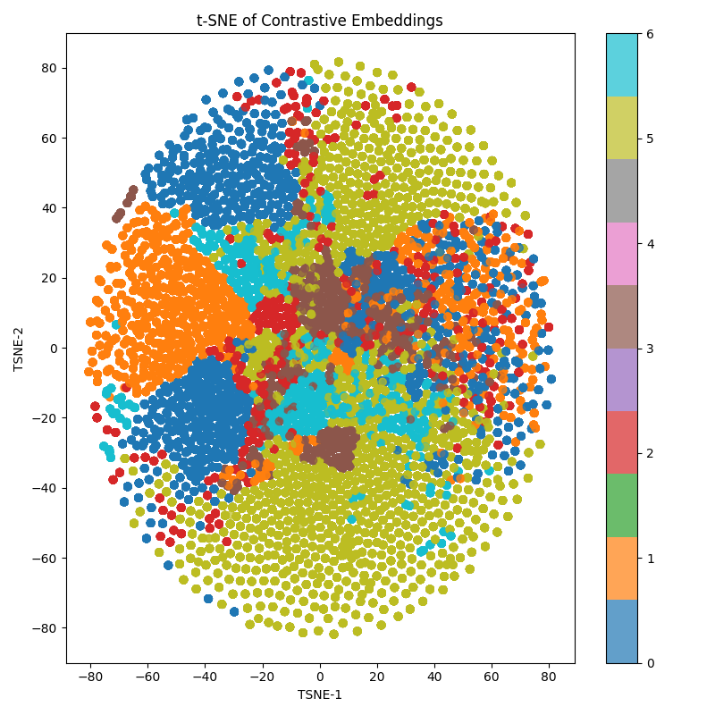

# Multimodal Classification

## Task-1: Unimodal Classification

### Experimental Results
The experiments on unimodal classification show that the **vision** modality provides the most discriminative features for material classification. Results are as follows:  

| Modality  | Accuracy | mAP    |
|-----------|----------|--------|
| Vision    | 65.63%   | 64.17% |
| Touch     | 45.17%   | 37.83% |
| Audio     | 33.38%   | 30.41% |

**Backbone Comparison (Vision):**  
| Backbone | Accuracy | mAP    |
|----------|----------|--------|
| ResNet   | 63.35%   | 62.25% |
| FENet    | 65.63%   | 64.17% |

FENet outperforms ResNet due to its use of **Fractal Analysis Pooling**, which better captures texture information.

### Deliverables
- Code and training curves are in `Models/` and `Training Curves/` folders.
- Vision encoder was fine-tuned for both ResNet and FENet backbones.

### Open Question
Touch and audio classifiers include spatial/frequency attention layers, yet vision outperforms them due to richer visual features and convolutional inductive bias suited for vision tasks.

---

## Task-2: Multimodal Classification

### Experimental Results
Multimodal classification outperforms unimodal methods:  

| Fusion Strategy | Accuracy | mAP    |
|-----------------|----------|--------|
| Late Fusion     | 62.22%   | 65.92% |
| Attention Fusion| 68.32%   | 67.77% |

### Deliverables
- Code and training curves are in `Models/` and `Training Curves/`.
- Attention fusion performs best due to multi-headed attention layers enabling cross-modal context.

### Open Question
Multimodal fusion helps classify visually similar materials by combining complementary modalities. However, attention fusion suffers from overfitting due to small dataset size.

---

## Task-3: Contrastive Learning

### Experimental Results
- **Contrastive Loss:** 16.81  
- Feature space visualizations (t-SNE plot) are included in the submission.

### Deliverables
- Code and training curves are in `Models/` and `Training Curves/`.

### Open Question
Contrastive learning aligns cross-modal representations (e.g., vision and touch) via InfoNCE loss. Key factors:  
- **Temperature:** Controls alignment stability.  
- **Batch Size:** Larger batches improve negative sampling.  
- **Frozen ResNet Backbone:** Hinders robust embedding learning.

---

## Task-4: Cross-Modal Retrieval

### Experimental Results
| Query → Target | mAP    | R@1    | R@5    |
|----------------|--------|--------|--------|
| Vision → Touch | 16.03% | 10.14% | 29.28% |
| Vision → Audio | 10.01% | 6.09%  | 26.09% |
| Touch → Audio  | 11.36% | 10.14% | 29.28% |

### Deliverables
- Code and evaluation results are in `Models/` and `Evaluation Results/`.

### Open Question
- Poor audio modality performance affects cross-modal retrieval.  
- Vision ↔ Touch works best due to shared ConvNet encoders for image-like data.  

---

**Figure 1:** t-SNE plot for contrastive learned feature space (see submission files).

  

